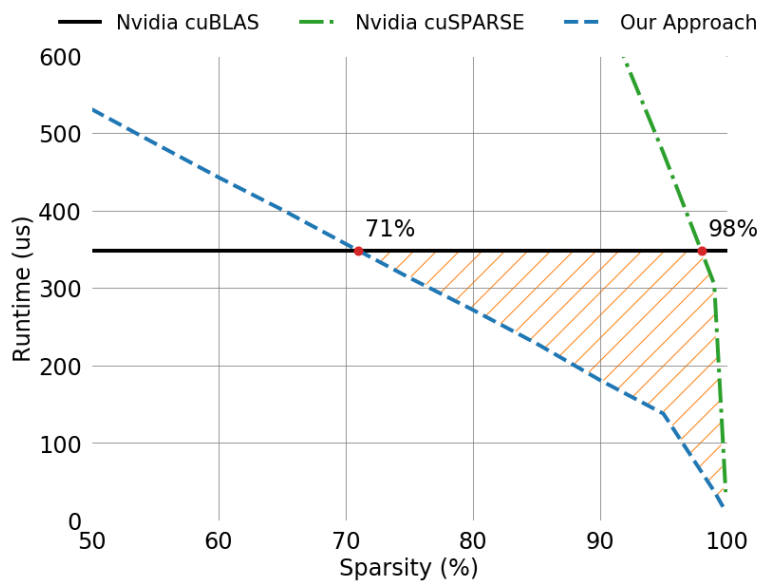
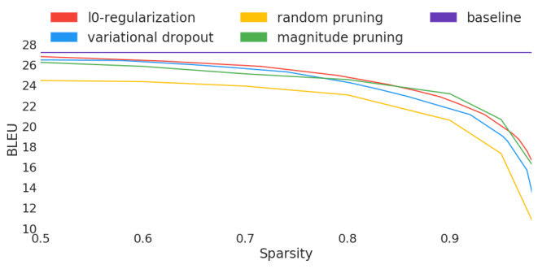
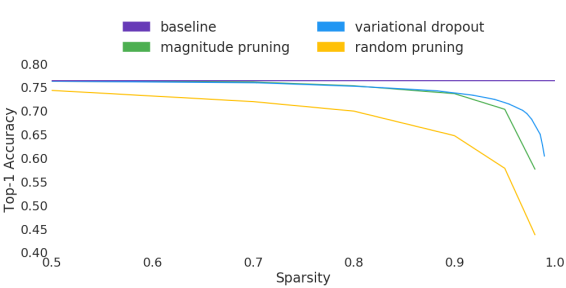

# The State of Sparsity in Deep Neural Networks

Gale, Trevor, Erich Elsen, and Sara Hooker. "The state of sparsity in deep neural networks." arXiv preprint arXiv:1902.09574 (2019).

## Notes

* Transformer trained on WMT 2014 English-to-German
* ResNet-50 trained on ImageNet
* They repeat the experiments performed by Frankle & Carbin (Lottery Ticket paper, 2018) and Liu et al. (Rethinking the Value of Network Pruning paper, 2018) at scale.
* Lie et al. re-train learned sparse topologies with a random weight initialization.
* Frankle & Carbin (2018) posit that the exact random weight initialization used when the sparse architecture was learned is needed to match the test set performance of the model sparsified during optimization.
* They evaluate:
  - Variational dropout
  - L0 regularization
  - Magnitude pruning

* The Transformer variant with magnitude pruning trains 1.24x and 1.65x faster than l0 regularization and variational dropout respectively.

* For magnitude pruning, they use Tensorflow's model pruning library.
* They were not able to replicate the phenomenon observed by Frankle & Carbin (2018). The key difference is the complexity of the tasks and scale of the models.
* They use the approach introduced in Zhu & Gupta (2017), which is available in the TensorFlow model pruning library.