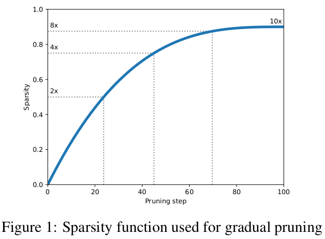
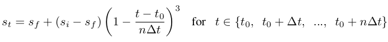

# To prune, or not to prune: exploring the efficacy of pruning for model compression

## Notes

* Compares large-sparse vs small-dense.
* Prunes the smallest magnitude weights to achieve a preset level of network sparsity.

* They extend TensorFlow for pruning.
* For every layer chosen to be pruned, they add a binary mask variable which is of the same size and shape as the layer’s weight tensor and determines which of the weights participate in the forward execution of the graph.
* The weights that were masked in the forward execution do not get updated in the back-propagation step

* Pruning is initiated after the model has been trained for a few epochs or from a pre-trained model.
* Pruning in the presence of an exceedingly small learning rate makes it difficult for the subsequent training steps to recover from the loss in accuracy caused by forcing the weights to zero.