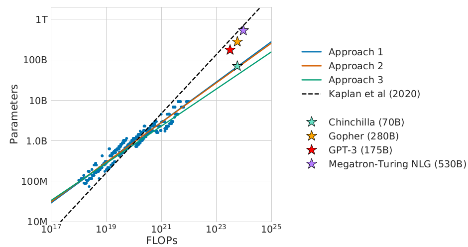
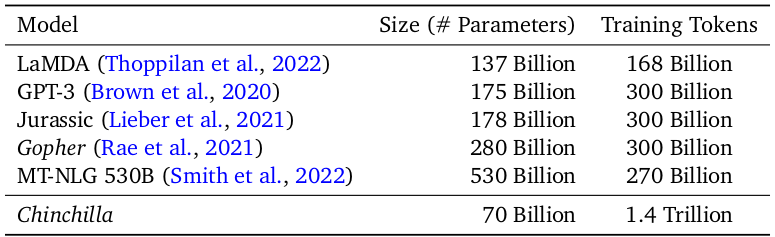
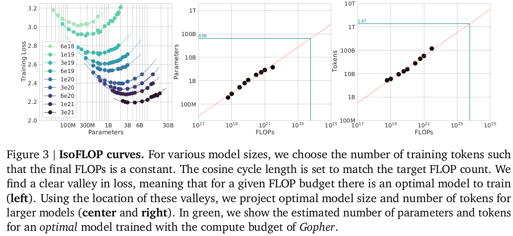
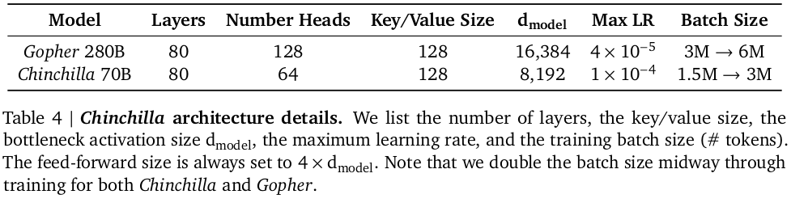

# Training Compute-Optimal Large Language Models

Hoffmann, Jordan, et al. "Training Compute-Optimal Large Language Models." arXiv preprint arXiv:2203.15556 (2022).

## Notes

* Main question: Given a fixed FLOPs budget, how should one trade-off model size and the number of training tokens?
* Current large language models are significantly undertrained
* For compute-optimal training, the model size and the number of training tokens should be scaled equally.

* Chincilla (70B) outperforms Gopher (280B) in all categories.

