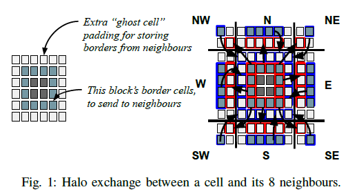
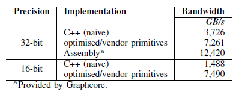
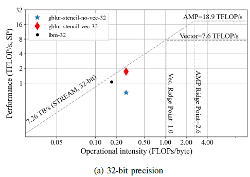
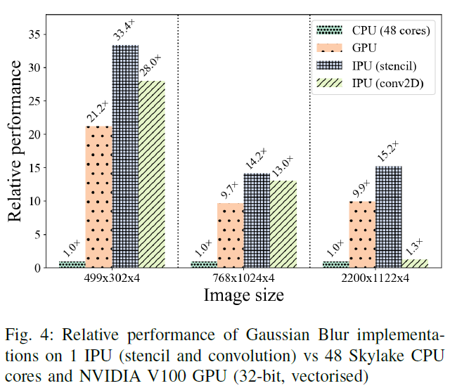
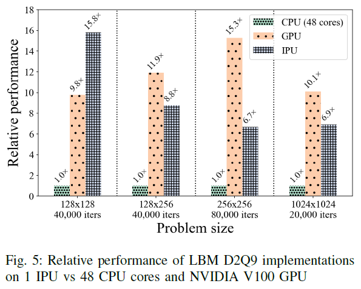

## Learn more about the followings:
* STREAM memory benchmark.
* Roofline performance model.
* Poplar

## Notes

* IPU was developed for AI apps. This paper tries to use it for traditional HPC apps such as stencils.
* Characterizes IPU's performance with **STREAM** memory benchmark and **Roofline** performance model.
* The authors employ two applications to test IPU's performance: the **Gaussian Blur filter** and a **2D Lattice Boltzmann fluid simulation**
* They implemented GPU kernels with OpenCL which is not fair in my opinion.

### Structured Grids
* They are commonly used in solvers for differential equations, such as those underpinning heat and fluid simulations.
* The domain under investigation is discretised onto a **regular grid of cells**. A cell’s neighbours can be located in a simple data structure using offset calculations, resulting in regular, predictable memory access patterns.

### Partitioning and Load Balancing
* Partitions should be small enough to allow using as many tiles as possible, yet not so small that the benefits of parallelism are outweighed by any increased communication between tiles. 
* Also we need to sub-partition work equally between the core’s 6 worker threads, and constrain subpartitions to fall along tensor slice dimensions for simplicity of implementation.
* If the grid does not fit into IPU's memory, then PCIe becomes the bottlenect (64 GB/s) but authors do not consider this case in this study.

### Halo Exchange

Stencil problems need to access the **halo** of boundary cells stored on surrounding neighbour tiles.

### Data Access Patterns
* The next timestep value of a cell depends on the previous timestep values of its neighbourhood. Hence, there is no inplace update (that's why they keep a temporary copy).
* **Poplar** adds a further data access constraint that tensor regions cannot be read and written by two different vertexes in the same compute set.

### STREAM Benchmark
One of the kernels in BabelSTREAM is used as the memory bandwidth ceiling when constructing Roofline performance model.

### Roofline
The y-axis represents performance attained in FLOP/s, while the x-axis represents operational intensity in FLOPs/byte – i.e. the amount of computation performed for each byte written to or read from main memory.

* In reality, any kernel that does not perform as least as many floating point operations as the number of bytes of memory accessed during computation is still memory bandwidth bound, and we should expect performance below 7.26 TFLOP/s for 32-bit compute. This is the limit that will apply to most HPC kernels.

### Gaussian Blur

### Lattice-Boltzmann Fluid Simulation

