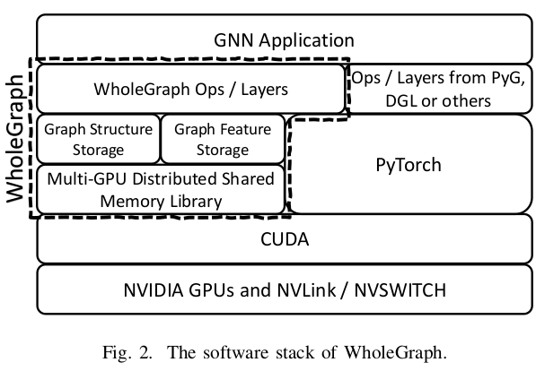

# WholeGraph: A Fast Graph Neural Network Training Framework with Multi-GPU Distributed Shared Memory Architecture

D. Yang, J. Liu, J. Qi and J. Lai, "WholeGraph: A Fast Graph Neural Network Training Framework with Multi-GPU Distributed Shared Memory Architecture," in 2022 SC22: International Conference for High Performance Computing, Networking, Storage and Analysis (SC) (SC), Dallas, TX, US, 2022 pp. 767-780

## What

A multi-gpu shared memory GNN framework.

## Why

In current frameworks, communication between CPU and GPU is the bottleneck. They take advantage of NVLINK instead of slow PCIe.

## How

They store all data on the memory of GPUs using distributed shared memory.

## Notes

* GNNs take the node or edge features from input graphs and import these features to various neural networks layer by layer.
* Each node needs to collect information from its neighbors to compute its output features during training.
* Most frameworks (DGL, PyG) store graph structures and features in CPU and train neural networks on GPU. CPU-GPU communication bounds the performance.
* WholeGraph uses memory of all GPUs to solve the memory problem.
* They use GPUDirect P2P instead of UM.

