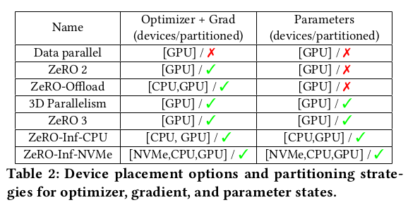

# ZeRO-Infinity: Breaking the GPU Memory Wall for Extreme Scale Deep Learning

Rajbhandari, Samyam, et al. "ZeRO-Infinity: Breaking the GPU Memory Wall for Extreme Scale Deep Learning." arXiv preprint arXiv:2104.07857 (2021).

## What

## Why

## How

## Notes

