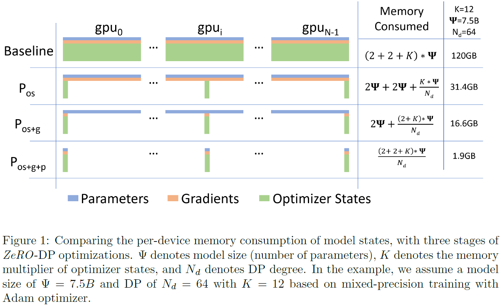
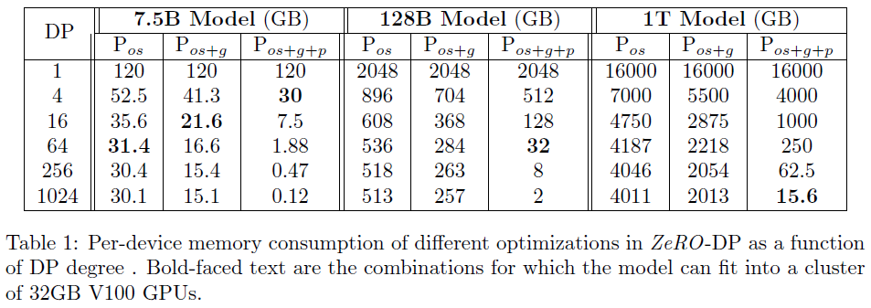

# ZeRO Memory Optimizations Toward Training Trillion Parameter Models

Rajbhandari, Samyam, et al. "Zero: Memory optimizations toward training trillion parameter models." SC20: International Conference for High Performance Computing, Networking, Storage and Analysis. IEEE, 2020.

## What
An optimizer to train very large models.

## Why
Large models give better accuracy but they don't fit into the memory of a GPU. There should be a scalable way to train these large models.

## How
Optimizes the memory efficiency of model states (optimizer state, gradients, parameters) and residual states (activations etc.).

## Notes

* Bert-large (0.3B params), GPT-2 (1.5B params), Megatron-LM (8.3B params), T5 (11B params)
* Current generation of GPUs with 32GB memory runs out of memory for models with more than 1.4B parameters.
* The largest models in the current literature, the 11B T5 model, and Megatron-LM 8.3B, were both powered by model parallelism, implemented in Mesh-Tensorfow and
Megatron-LM, respectively.
* Model parallelism does not scale well beyond single node.
* The majority of memory is occupied by model states:
  - Optimizer state (momentum, variances etc.)
  - Gradients
  - Parameters
* Rest is consumed by activation and temporary buffers.
* DP has good compute/communication effciency but poor memory efficiency while MP can have poor compute/communication effiency. 
* DP and MP maintain all the model states required over the entire training process statically, even though not all model states are required all the time during the training.

* ZeRO-DP has three main optimization stages:
  - Optimizer State Partitioning (4x reduction)
  - Gradient Partitioning (8x reduction)
  - Parameter Partitioning (DP degree reduction)

* ZeRO-R partitions activations or offloads them to CPU.
* ZeRO-R manages fragmented memory problem.

